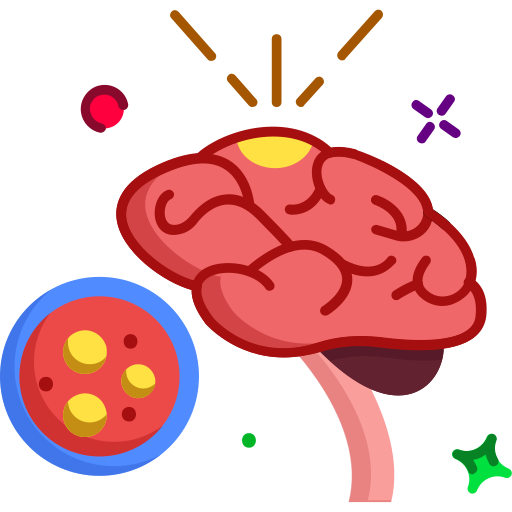
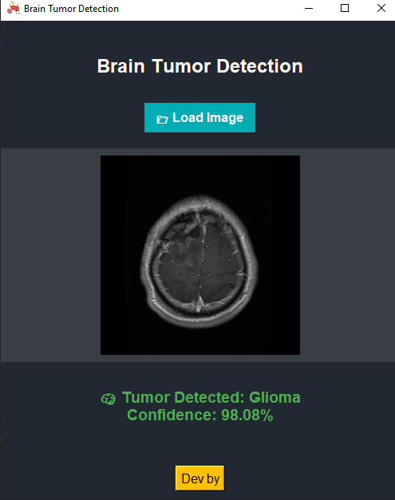

# 🧠 Brain Tumor Detection – Tkinter + Deep Learning App

<p align="center">
  
</p>

---

## 📌 Overview

This is a desktop GUI application built with **Python** and **Tkinter** to automatically detect and classify brain tumors from medical images using a pre-trained deep learning model (TensorFlow/Keras).

---

## 💡 Features

- 🧠 Utilizes a trained **Keras** model to classify brain scans into:
  - **Glioma**
  - **Meningioma**
  - **Pituitary**
  - **No Tumor**
- 🌙 Dark mode **Tkinter GUI** for a modern and eye-friendly experience.
- 📷 Allows users to **upload and display** brain scan images.
- 📊 Shows **prediction confidence** after analysis.
- 👨‍💻 Includes an "About" section with **developer information**.
- 🎨 Smooth and responsive UI layout.

---

## 🧪 Requirements

Install the required Python libraries with:

```bash
pip install tensorflow pillow numpy
```

---

## 🗂️ Project Structure

```
brain-tumor-detection/
├── brain_tumor_model.keras     # Pre-trained model file
├── brain-cancer.png            # Application icon
├── main.py                     # Main application script
└── README.md                   # Project documentation
```

---

## 🚀 How to Run

Make sure the following files are in the same directory:

- `main.py`  
- `brain_tumor_model.keras`  
- `brain-cancer.png`  

Launch the application by running:

```bash
python main.py
```

Use the GUI to:

- 📂 **Load Image** – Upload a brain scan image for diagnosis.
- 🧠 **View tumor classification** and **confidence score**.
- 👨‍💻 Click **Dev by** to view developer details.

---

## 👨‍💻 Developer

- **Name**: Bouagal Houssem Eddine  
- **Field**: Artificial Intelligence & Medical Imaging  
- **Tech Stack**: Python (Tkinter + TensorFlow)

---

## 📌 Notes

✅ The AI model is pre-trained and loaded during runtime.

📦 You can convert this app into a standalone executable using:

- `pyinstaller`
- `auto-py-to-exe`

🛑 If the icon file is missing, the application will still function, but without a custom icon.

---
## 🧊 Screenshot



## 📄 License

This project is licensed under the **MIT License**.
